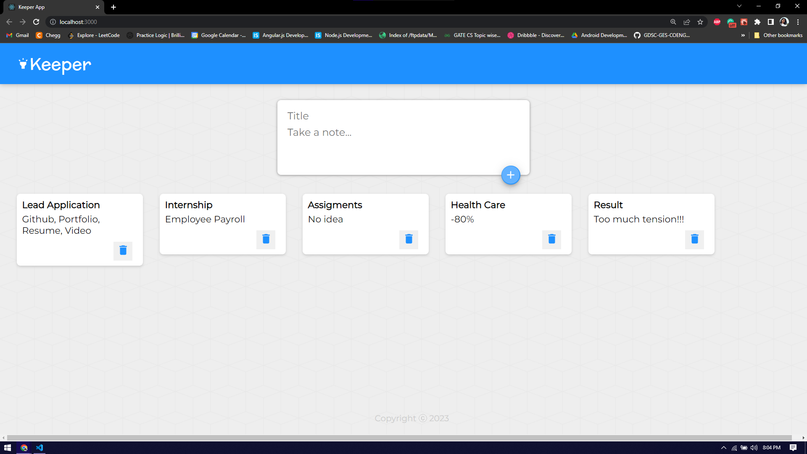

# Keeper App 💡

## Description 📝

An App that lets you keep your little notes like Google Keep.

- Used to create organized short notes
- Created for learning the fundamentals of React development

## Table of Contents

If your README is long, add a table of contents to make it easy for users to find what they need.

- [Installation](#installation)
- [Technologies](#technologies)
- [Usage](#usage)

## Installation ⚙

- Download or Clone Repository
- run `npm install`
- run `npm start`

## Technologies

- React.js
- HTML
- CSS

## Usage

This App has pretty self explanatory UI.

